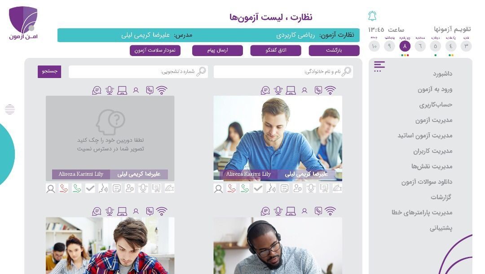
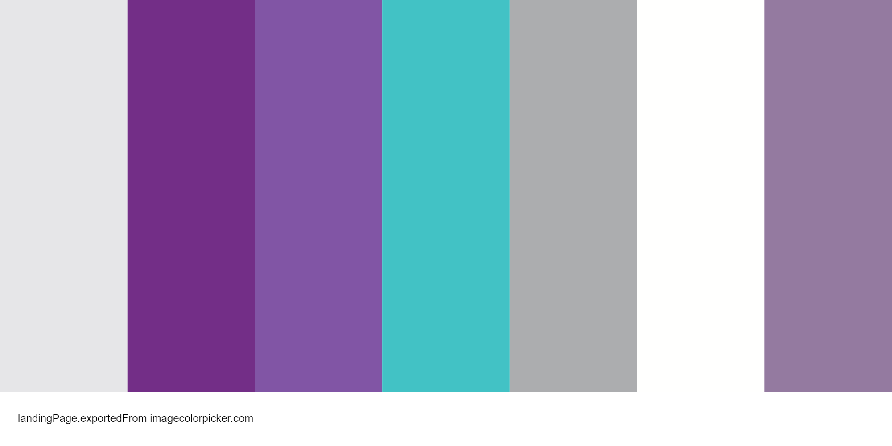

## پروژه فرانت-اند

<p>
در حال حاضر به شناخت کافی از HTML و CSS و JS  رسیده‌ایم. پروژه زیر را برای آشنا شدن بیشتر با سبک پروژه‌های واقعی فرانت-اند پیاده‌سازی کنید.
با این کار به درک و شناخت بهتری نسبت به صفحات وب میرسید. در نتیجه برای نوشتن تست‌های اتومات، مسیر هموار‌تری را تجربه خواهید کرد. <br>
مشابه تصویر زیر، نیاز داریم صفحه‌ای طراحی کنیم که یک ادمین بتواند نحوه آزمون آنلاین دانش‌آموزان را مانیتور کند.
</p>



<p>

هدف ما، طراحی صفحه‌ای دقیقا مشابه عکس فوق نیست و شباهت کلی با تصاویر قابل قبول است.( در روند طراحی از ایده‌های خود برای بهبود طراحی استفاده کنید.) <br>
در طراحی صفحه به نکات زیر توجه کنید:
- صفحه به صورت 
Responsive
طراحی شود.
- تمامی آیکون‌های داخل صفحه و دکمه‌ها باید حالت لینک داشته باشند.
- با استفاده از JS  باید تقویم بالای صفحه را به نحوی پیاده‌سازی کنید که تاریخ و ساعت درست را در لحظه نمایش دهد.کارکرد تقویم بدین صورت است که روز فعلی با رنگ فوق از روزهای دیگر متمایز می‌شود.(فرمت ساعت 24 ساعته و مبنای تقویم شمسی است)
- با کلیک روی آیکون 
Sidebar
باید منوی سمت راست بسته و باز شود.
- کد رنگ‌های استفاده شده در صفحه به شرح زیر است که در پالت زیر قابل مشاهده‌اند.

</p>

<div style="text-align:center">
    
</div>

```
CSS Code:

/* CSS HEX */
--iron: #e6e6e8;
--eminence: #732e87;
--deluge: #8155a5;
--pelorous: #42c2c5;
--bombay: #acadaf;
--black-white: #fffffe;
--trendy-pink: #947aa0;


/* SCSS HEX */
$iron: #e6e6e8;
$eminence: #732e87;
$deluge: #8155a5;
$pelorous: #42c2c5;
$bombay: #acadaf;
$black-white: #fffffe;
$trendy-pink: #947aa0;


/* SCSS RGB */
--iron: rgba(230,230,232,255,1);
--eminence: rgba(115,46,135,255,1);
--deluge: rgba(129,85,165,255,1);
--pelorous: rgba(66,194,197,255,1);
--bombay: rgba(172,173,175,255,1);
--black-white: rgba(255,255,254,255,1);
--trendy-pink: rgba(148,122,160,255,1);

```