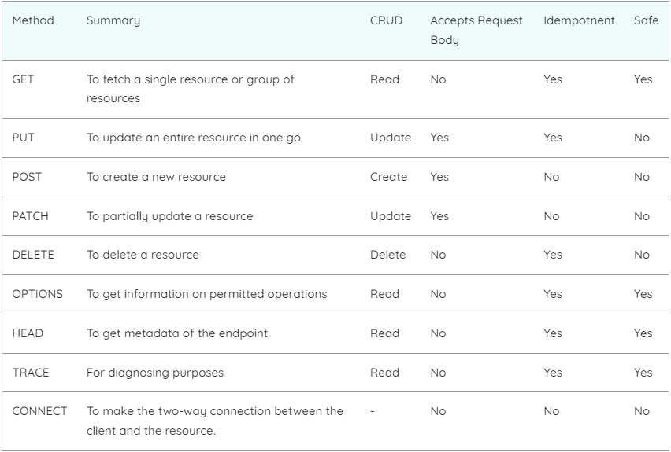

## API چیست؟

<p>

رابط برنامه نویسی کاربردی یا
**A**pplication **P**rogramming **I**nterface
مجموعه‌ای از قوانین تعریف شده هستند که توانایی ارتباط‌گیری میان نرم‌افزار‌ها (یا سرویس‌های) مختلف باهم را  فراهم می‌کنند. API مانند یک لایه واسط عمل می‌کند که داده را میان سیستم‌ها یا سرویس‌های مختلف منتقل می‌کند و به سرویس‌ها یا نرم افزار‌ها کمک می‌کند تا بتوانند با یک توسعه‌دهنده شخص سوم 
(third-party developer)
عملکرد یا داده‌های نرم‌افزار خود را به اشتراک بگذارند. 

</p>

> **Important**
> سایت بدون فیلترشکن بالا نمی‌آید پس از همین ابتدا فیلترشکن خود را روشن نمایید

<p>

برای توضیح بهتر این موضوع، اجازه دهید یک مثال آشنا بیاوریم. تصور کنید پشت میزی در یک رستوران نشسته اید و منویی از انتخاب‌ها برای سفارش دادن دارید . آشپزخانه بخشی از “سیستم” است که سفارش شما را آماده می‌کند. چه چیزی کم است‌؟ آفرین !! یک پیوند میان شما و آشپزخانه که سفارش شما را به آشپزخانه منتقل کند و غذای شما را به میز تحویل دهد. اینجاست که پیشخدمت یا API وارد عمل می‌شود . <br>
پیشخدمت یک پیام رسان (یا 
API
) است که درخواست یا سفارش شما را می‌گیرد و به آشپزخانه (‌سیستم‌) می‌گوید که چه کاری انجام دهد. سپس گارسون پاسخ آشپزخانه را به شما تحویل می‌دهد. در این مورد، آن پاسخ غذا است.

</p>

<div style="text-align:center">
    
</div>

## API چگونه کار می کند؟

<p>

ساختار API‌ها معمولا با مفاهیم 
Client
و 
Server
تعریف می‌شود. نرم‌افزاری که درخواست را ارسال می‌کند 
Client
نامیده می‌شود و نرم افزاری که جواب را برمی‌گرداند 
Server
است د. مثلا در یک پیام‌رسان (مانند 
[سروش‌پلاس](https://splus.ir))
، نرم افزاری که روی گوشی شما نصب می‌شود (مانند نرم افزار 
Android)
کلاینت نامیده می‌شود و نرم‌افزاری که روی دیتاسنترهای سروش‌پلاس نصب شده است که پاسخ درخواست شما را می‌دهد سرور نامیده می‌شود.

</p>

<p>

چهار روش مختلف وجود دارد که API ها میتوانند وابسته به استفاده کار کنند:
- **SOAP API**: <br>
این نوع 
API
‌ها از پروتکل 
[Simple Object Access](https://www.ibm.com/docs/en/sc-and-ds/8.1.0?topic=stack-simple-object-access-protocol)
استفاده می‌کند. 
Client
و سرور با استفاده از 
XML
[(چیست؟)](https://aws.amazon.com/what-is/xml/#:~:text=Extensible%20Markup%20Language%20(XML)%20is,perform%20computing%20operations%20by%20itself.)
با یکدیگر ارتباط برقرار می‌کنند. 
برای کسب اطلاعات بیشتر درباره این نوع 
API
می‌توانید 
[اینجا](https://www.techtarget.com/searchapparchitecture/definition/SOAP-Simple-Object-Access-Protocol)
را بخوانید.
- **REST API**: <br>
این API محبوب‌ترین API میان برنامه‌نویسان در وب است. کلاینت درخواست خود را به عنوان دیتا به سرور ارسال می‌کند. سرور از این درخواست ارسال شده توسط کلاینت برای شروع عملکردهای داخلی استفاده می کند و داده‌های خروجی را به کلاینت برمی‌گرداند. <br>
می‌توانید از [اینجا](https://www.ibm.com/topics/rest-apis#:~:text=the%20next%20step-,What%20is%20a%20REST%20API%3F,representational%20state%20transfer%20architectural%20style.) اطلاعات بیشتری درباره این نوع API به‌دست آورید .

<div style="text-align:center">
    
</div>

- **RPC API**: <br>
این نوع 
API
ها 
Remote Procedure Calls
نامیده می‌شوند. در این نوع 
API
،کلاینت یک تابع (یا رویه) را در سرور تکمیل می‌کند و سرور خروجی را برای کلاینت ارسال می کند. <br>
میتوانید جهت خواندن بیشتر در مورد این نوع 
API
[اینجا](https://blog.faradars.org/rpc-%DA%86%DB%8C%D8%B3%D8%AA/)
را بخوانید.

<div style="text-align:center">
    
</div>

- **Websocket API**: <br>
[این نوع](https://docs.aws.amazon.com/apigateway/latest/developerguide/apigateway-websocket-api-overview?pg=wianapi&cta=websocketapi)
API
یک نوع مدرن از 
API
است که برای انتقال داده از 
JSON
[(چیست؟)](https://www.w3schools.com/js/js_json_intro.asp)
استفاده می‌کند. این 
API
از حالت دوطرفه بین 
Client
و 
Server
نیز پشتیبانی می‌کند. سرور می‌تواند پیام 
[Callback](https://swagger.io/docs/specification/callbacks/)
برای کلاینت ارسال کند که بازدهی آن را نسبت به 
REST
بیشتر می‌کند.
- **API Integration**: <br>
API Integration 
‌ها اجزائی از نرم‌افزار هستند که به صورت خودکار داده را میان کلاینت و سرور به روز می‌کنند. مثال‌هایی از این را می‌توان در 
sync
شدن داده در 
Cloud 
‌هایی مانند 
OneDrive
دید.

</p>

## انواع مختلف متد‌های API

<p>

برخی از مهم ترین 
[Method](https://testfully.io/blog/http-methods/)
های 
HTTP
وجود دارد که باید به عنوان یک 
QA
برای تست 
API
های 
RESTful
برای برنامه بدانید. 
API
های 
RESTful
آنهایی هستند که از سبک معماری 
REST
پیروی می کنند.


</p>

<div style="text-align:center">
    
</div>

## شناخت ساختار JSON

<p>

جیسون یا
JSON
مخفف 
JavaScript Object Notation
و یک فرمت متن برای ذخیره و انتقال داده است، این نوع نوشتن 
[Self-describing](https://snowplow.io/blog/introducing-self-describing-jsons/)
«خود توصیف‌گر» و همچین شدیدا ساده است.
نوع نوشتار 
JSON
به شکل 
name/value
است و همچنین ساختار 
parent/child
دارد. همچنین داده ها با کاما (,) از یکدیگر جدا می‌شوند. و براکت "[]" یک آرایه را نشان می‌دهد. <br>
```"name": "John"```

</p>

<p>

یک نمونه ساده از 
JSON
را در پایین مشاهده می کنید:<br>

```{```<br>
```"employees":[```<br>
```	{"firstName": "John", "lastName": "Doe"},```<br>
```	{"firstName": "Anna", "lastName": "Smith"},```<br>
```	{"firstName": "Peter", "lastName": "Jones"}```<br>
```]```<br>
```}```<br>

برای خواندن در مورد نحوه نوشتار 
JSON
می‌توانید به [اینجا](http://w3schools.com/whatis/whatis_json.asp) یا [اینجا](https://www.json.org/json-en.html) مراجعه کنید. 

</p>

## استفاده از Postman برای ارسال API و دریافت پاسخ آن

<p>

پلتفرم 
Postman
یک پلتفرم برای ساخت و استفاده از 
API
است. 
Postman
هر مرحله از چرخه عمر 
API
را ساده می‌کند تا بتوانید 
API
های بهتر و سریع‌تری ایجاد کنید.
از [این لینک](https://www.postman.com/product/what-is-postman/) می‌توانید بیشتر در مورد 
Postman
بخوانید.<br>
برای آموزش نحوه کار با 
Postman
[این ویدئو ها](https://www.youtube.com/watch?v=Qx0aIoz9Lxw&list=PLL34mf651faNJ6Wm8elGZl5mr9Zf14dWH)
استفاده کنید.

</p>

<div style="text-align:center">
    
</div>

> **Important**
> لینک های هر بخش را به طور کامل مطالعه کنید. همچنین ویدئو های هر بخش را به طور کامل مشاهده کنید.
