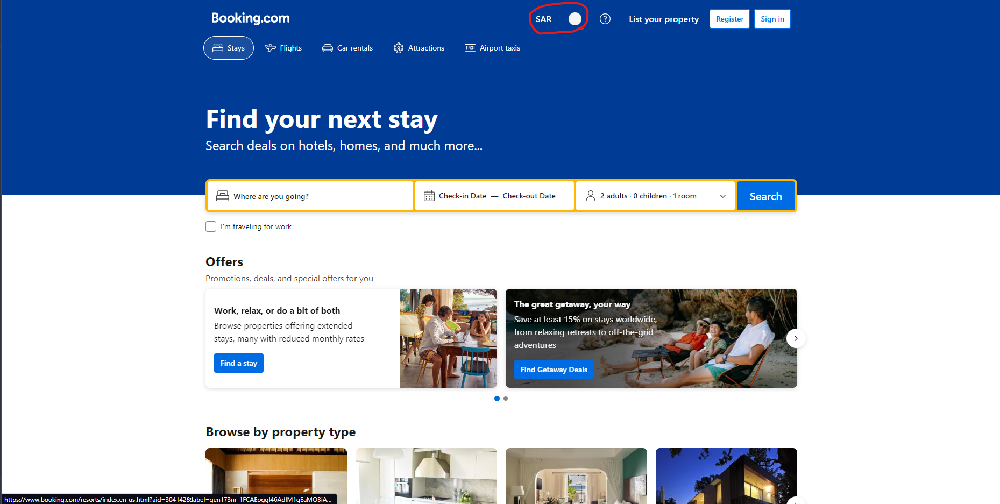
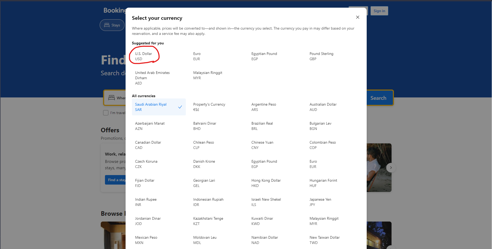
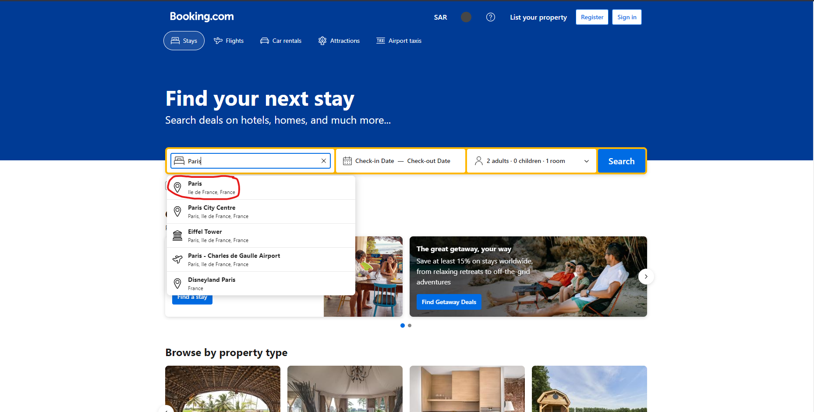
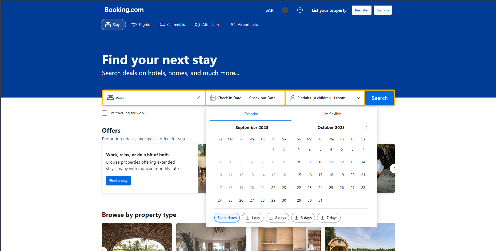
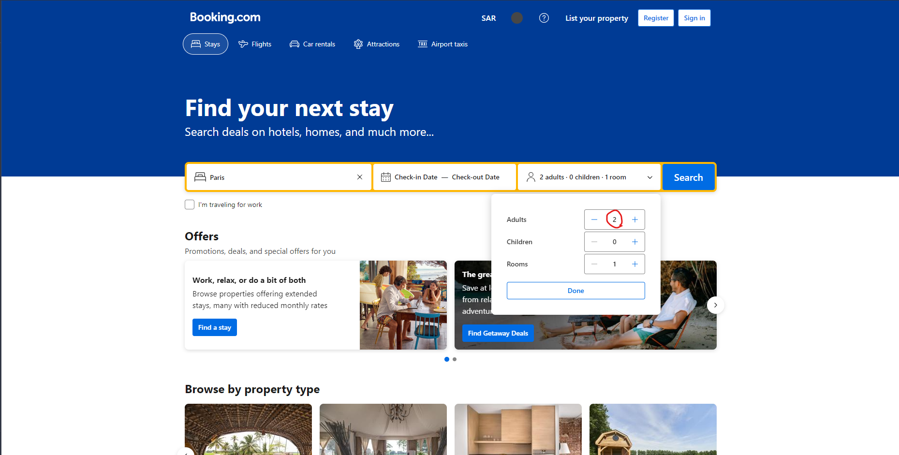
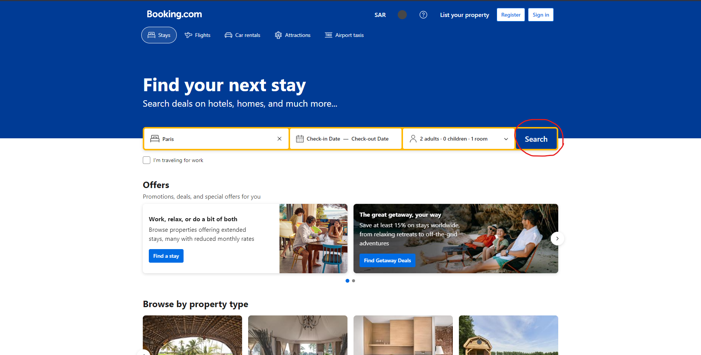
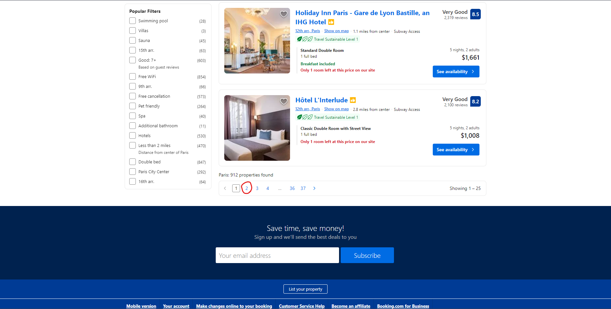

## Selenium

سلنیوم یا
[Selenium](https://www.selenium.dev/)
یک ابزار بسیار مفید برای تست اتوماتیک سرویس‌های تحت وب است. 
Selenium
به صورت شبیه‌سازی شده، یک مرورگر را در سیستم‌عامل باز می‌کند و دستورات (کدهای) نوشته شده را توسط مرورگر، خط به خط اجرا می‌کند و بعد از انجام دستورات، بسته می‌شود. 
سلنیوم را می‌توان به صورت یک کتابخانه در 
python
استفاده کرد ولی قبل از آن نیاز است که 
WebDriver
آن را نصب کرده باشید. از طریق [این لینک](https://www.selenium.dev/downloads/) می‌توانید 
WebDriver
مربوط به سلنیوم را دانلود کنید.
ویدیوی آموزش نحوه نوشتن کد پایتون سلنیوم و اجرای آن را از طریق [این لینک](https://drive.google.com/file/d/1NnVwLjBs3fQ2uXCYpCwfKvETyrYWSkSR/view) ببینید.

    

### تمرین: پیاده‌سازی یک سناریوی تست شبه‌واقعی روی Booking.com

پس از آموزش کامل دوره سلنیوم، در این پروژه شما قرار است یک سناریوی تست را در یک سایت معروف (Booking.com) انجام دهید. لازم به ذكر است برای انجام این روال شما مجاز به استفاده از تمام كتابخانه‌های مرسوم selenium خواهید بود و محدودیت خاصی در این بخش نخواهید داشت.  
شما بایستی سناریوی زیر را با استفاده از سلنیوم در پایتون اجرا کنید و کد نهایی را برای mentor خود ارسال کنید. همچنین یک بار نیز کد را برای mentor خود اجرا کنید.

**سناریوی تست:**

1. اول سایت 
Booking.com
را باز کند و ارز را به 
USD
تغییر دهد. (مانند تصاویر)

    

    

2. سپس فیلد شهر مقصد را با شهر دلخواه (مثلا 
Paris)
پر کند و شهر مدنظر را انتخاب کند. (مشابه عکس) 

    

3. سپس تاریخی دلخواه را انتخاب کند. (کد نوشته شده باید قادر باشد در صورت انتخاب ماه‌های آینده با ورق زدن صفحه تاریخ ماه مدنظر را پیدا کند، همچنین باید تمامی حالات انتخاب ماه در کد در نظر گرفته شود -مانند انتخاب روزهایِ ماه ورودی و خروجی در آن‌ها متفاوت است.-)

    

4. سپس تعداد 
Adult
را به تعداد دلخواه تغییر دهد.

    

5. بعد انجام جستجو تا پایین صفحه 
Scroll
کند و وارد صفحه بعد شود.

    

    

