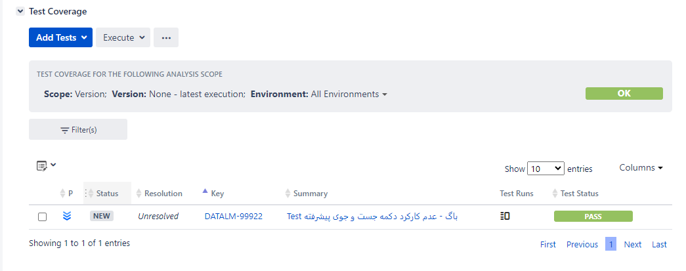
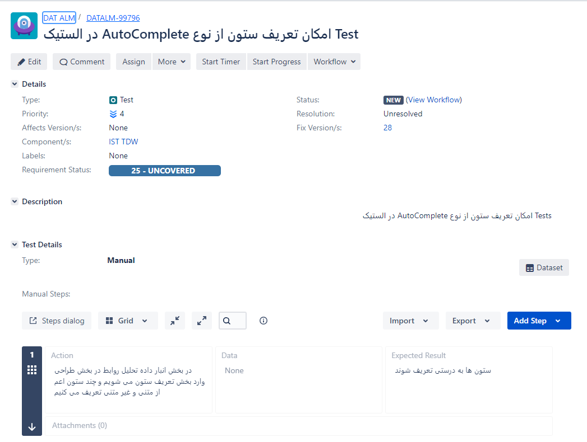
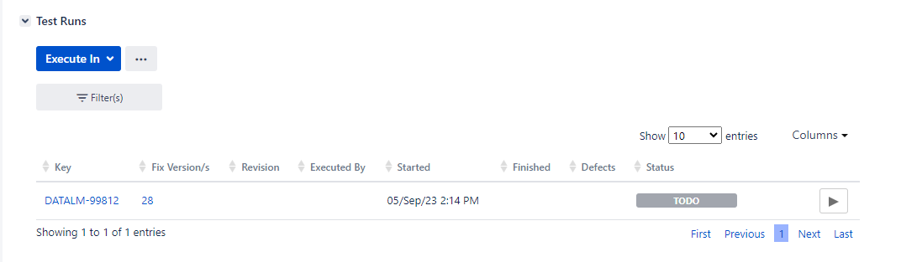
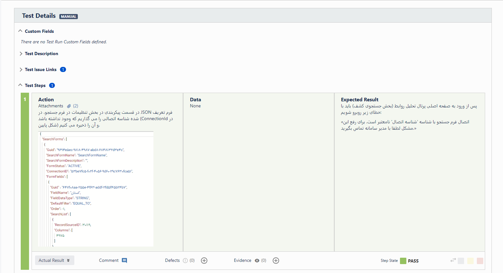
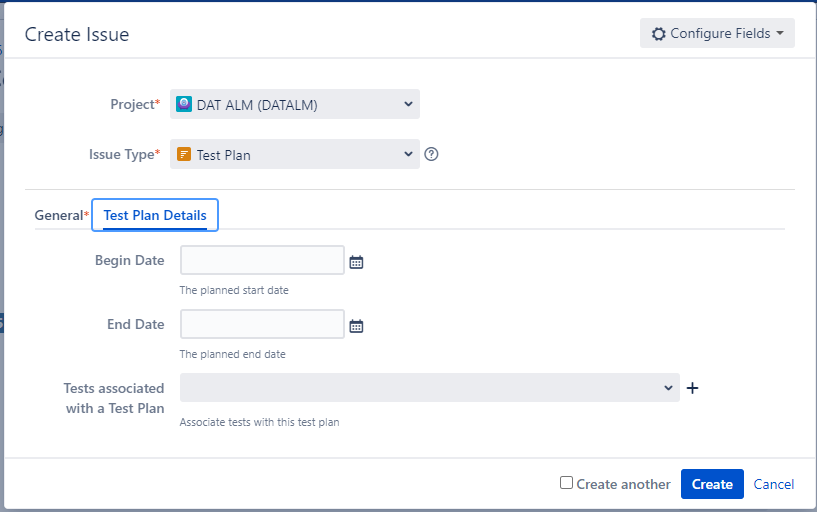
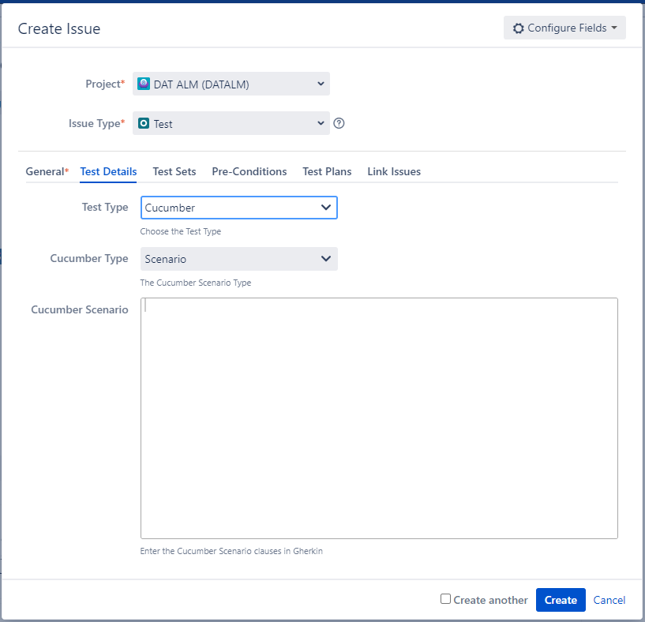
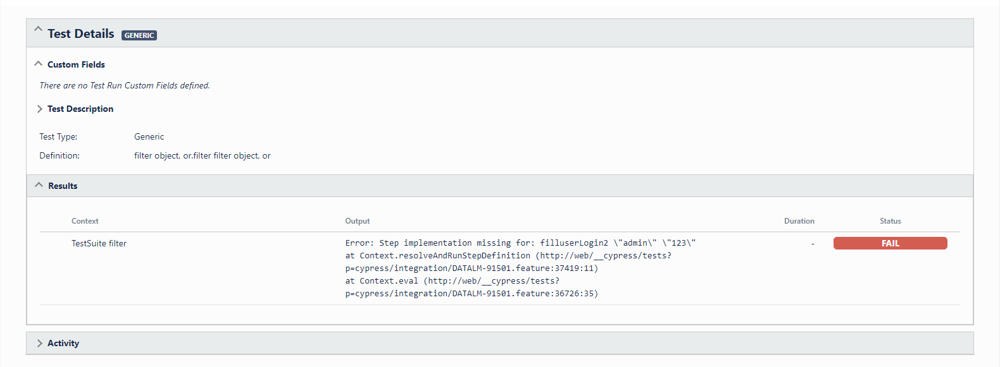
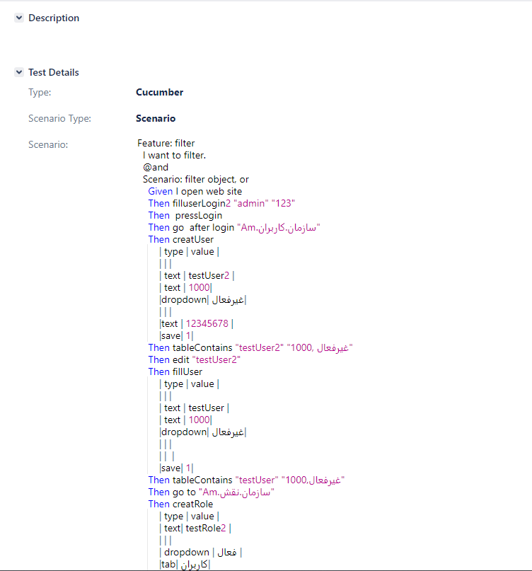

## تست خودکار (اتوماتیک)

تست خودکار یک تکنیک تست است که در آن، فرآیند ارزیابی کارکرد نرم‌افزار قبل از تحویل، به طور خودکار انجام می‌شود. با استفاده از تست خودکار، می‌توان تست‌هایی که اجرای آن به صورت دستی بوده را با سرعت خیلی بیشتری انجام داد. تست خودکار برای اجرای تست‌های بسیار بزرگ (تست کلی محصول) یا تست‌هایی با اجرای مداوم است (مانند 
Smoke Test
([چیست؟](https://www.techtarget.com/searchsoftwarequality/definition/smoke-testing#:~:text=Smoke%20testing%2C%20also%20called%20build,not%20delve%20into%20finer%20details.)) ).  
بزرگترین مزیت تست خودکار، این است که مقادیر زیادی از تست‌های دستی را به یک ریپازیتوری کد تبدیل و ساده‌سازی می‌کند. تست‌های خودکار می‌توانند به طور مکرر در هر زمانی از روز اجرا شوند و بخش بسیار مهمی از Continuous Integration و Continuous Delivery در رویه‌های توسعه نرم‌افزار هستند.

مراحل تست خودکار:
1. **یک ابزار تست را انتخاب کنید**. ابزار انتخاب شده بستگی به نوع تست دارد و  این ابزار باید از پلتفرمی که نرم‌افزار بر روی آن در حال توسعه است، پشتیبانی کند.
2. **محدوده اتوماسیون را تعریف کنید**. این بدان معناست که چه مقدار از تست‌های انجام شده روی نرم‌افزار، خودکار است.
3. **برنامه‌ریزی، طراحی و توسعه**: این مرحله شامل برنامه‌ریزی و توسعه کدهای تست است.
4. **اجرای تست**: در این مرحله، نرم‌افزار با استفاده از کدهای اتوماتیک تست می‌شود. ابزار تست همچنین باید داده‌ها را جمع‌آوری کرده و گزارش‌های دقیق تست را ارائه دهد.
5. **نگهداری کدها**: اسکریپت‌های تست خودکار در صورت نیاز با نسخه‌های جدیدتر اصلاح و به‌روز می‌شوند.

انواع تست‌های خودکار شامل موارد زیر است:
- [Acceptance tests](https://www.techtarget.com/searchsoftwarequality/definition/acceptance-test#:~:text=Acceptance%20testing%20is%20a%20quality,testing%20or%20end%2Duser%20testing.)
- [API tests](https://www.techtarget.com/searchapparchitecture/definition/API-testing)
- [Integration tests](https://www.techtarget.com/searchsoftwarequality/definition/integration-testing)
- [Regression tests](https://www.browserstack.com/guide/regression-testing#:~:text=Regression%20Testing%20is%20a%20type,the%20introduction%20of%20new%20changes.)
- [Smoke tests](https://www.techtarget.com/searchsoftwarequality/definition/smoke-testing#:~:text=Smoke%20testing%2C%20also%20called%20build,not%20delve%20into%20finer%20details.)
- [System tests](https://www.techtarget.com/searchsoftwarequality/definition/system-testing#:~:text=System%20testing%2C%20also%20referred%20to,full%2C%20integrated%20system%20or%20application.)
- [Unit tests](https://en.wikipedia.org/wiki/Unit_testing)
- [User interface (UI) tests](https://www.browserstack.com/guide/ui-testing-guide)

    

فریمورک ([چیست؟](https://www.codecademy.com/resources/blog/what-is-a-framework/))های مرسوم تست خودکار به شرح زیر هستند:
- [Data-Driven Frameworks](https://testsigma.com/data-driven-testing)
- [Keyword-driven Frameworks](https://www.guru99.com/keyword-driven-testing.html) 
- [linear scripting framework](https://www.softwaretestingmaterial.com/types-test-automation-frameworks/#Linear-Scripting-Framework)
- [modular testing framework](https://www.softwaretestingmaterial.com/types-test-automation-frameworks/#Modular-Testing-Framework)

فریمورک اسکریپت خطی برای برنامه‌های کاربردی کوچک مناسب است، زیرا استفاده از یک اسکریپت آزمایشی را با برنامه‌ریزی کمتر امکان پذیر می‌کند. اما این اسکریپت‌ها قابل استفاده مجدد نیست. فریمورک تست ماژولار، اسکریپت‌هایی را به‌عنوان تست‌های کوچک و مستقل ایجاد می‌کند تا افزونگی را کاهش دهد، اما این فرآیند معمولاً زمان بیشتری نیاز دارد.
با فریمورک‌های مبتنی بر داده 
(Data-Driven)
، می‌توان اسکریپت‌هایی نوشت که برای مجموعه‌های داده‌های متعدد کار کند. این نوع فریمورک‌ها پوشش گسترده‌تری را با آزمایش‌های کمتر، نسبت به فریمورک‌های ماژولار، ارائه می‌دهند.  
ابزارها و فریمورک‌های تست خودکار شامل 
Selenium،
Robot Framework
و 
Cypress
هستند.
[Robot Framework](https://robotframework.org/)
به تسترها کمک می‌کند تا تست‌های 
User acceptance،
Performance,
System acceptance
را برای دستگاه‌های 
Android
توسعه دهند.
Cypress
تست‌های 
end-to-end،
Integration
و 
Unit
را در یک مرورگر پوشش می‌دهد.

### Xray

Xray
یک ابزار مدیریت تست کامل برای 
Jira
است. این یک برنامه با امکانات کامل است که برای اجرا به نرم افزار دیگری نیاز ندارد.
از کل چرخه عمر تست پشتیبانی می‌کند:
-  برنامه ریزی تست
- طراحی تست
- اجرای تست 
- گزارش تست

Xray
این کار را با استفاده از ایشو تایپ‌های 
Jira
انجام می‌دهد، بنابراین می‌توانید از تمام مزایای 
Jira
که استفاده کنید.
هدف 
Xray
کمک به شرکت‌ها در بهبود کیفیت سیستم‌های خود از طریق تست موثر و کارآمد است. به همین دلیل است که 
Xray
در حال حاضر از تست‌های دستی و خودکار، از جمله 
BDD
(مانند: 
Cucumber،
SpecFlow،
Serenity BDD)
پشتیبانی می‌کند.
با استفاده از 
Xray
می‌توانید انواع مفاهیم تست مانند 
Test Plan, Test Execution, Test Case
و ... را با جیرا پیاده‌سازی کنید:

### Test (Manual)

با اضافه کردن افزونه Xray به Jira، یک ایشو تایپ جدید به جیرا اضافه می‌شود که نامش Test است. مشابه عکس زیر می‌توان به استوری ها تست اضافه کرد. اگر روی دکمه Add Test کلیک کنید می توانید این کار را انجام دهید ، این نوع ایشو مشابه سایر ایشو های جیرا است.

    

### Test Step (Manual):

هنگامی که وارد ایشو تایپ تست می‌شویم، مراحل تست را می توان از طریق 
Test Step
به تست اضافه کرد. مانند تصویر زیر: (تصویر یک مثال واقعی از ایشو تایپ تست یک استوری در ستاره است) 
در هر 
Step
سه قسمت داریم که شامل:
- **Action**: عملی که باید برای تست انجام دهیم.
- **Data**: داده ای که برای تست این مرحله به آن نیاز داریم. (مثلا اطلاعات ورود در صفحه لاگین)
- **Expected Results**: نتیجه‌ای که انتظار داریم محصول نسبت به کار ما داشته باشد. (مثلا ورود به صفحه اصلی پس از لاگین با دکمه ورود)

    

### Test Run & Test Execution (Manual)

در هر ایشوی تست می‌توانید در قسمت 
Test Runs
با استفاده از گزینه 
Excecute in
یک 
Test Execution
جدید بسازید. با این کار یک 
Issue
جدید در جیرا ساخته می‌شود. در این ایشو می‌توانید نتایج تست هر 
Test Step
را با گزینه‌های 
Pass
و 
Fail
مشخص کنید. (مشابه تصویر)

    

    

### Test Plan

برای اجرای چندین تست با یکدیگر می‌توان یک ایشو در جیرا به نام 
Test Plan
ساخت. این ایشو تایپ با تنظیم زمان مشخص و تست‌های مرتبط، می‌تواند تست ها را اجرا کند. (مشابه تصویر)

    

### Test (Automatic)

در ایشو تایپ تست یک گزینه وجود دارد که می‌توان بر اساس آن، نوع تست (دستی یا اتوماتیک بودن) را مشخص کرد. (Test Type در تصویر زیر) این گزینه شامل سه حالت است: 
- Manual
- Cucumber
- Generic

با قرار دادن این گزینه روی حالت Cucumber می‌توان کد سناریو Cucumber (که مثلا متصل به کدهای Cypress است) را اجرا کرد. این کد به صورت اتوماتیک اجرا می‌شود و نتیجه را برمی‌گرداند. 

    

### Test Run & Test Execution (Automatic)

در ایشوهای تست اتوماتیک نیز می‌توانید در بخش 
Test Execution
یک ایشوی اجرای تست بسازید. 
مانند بخش گذشته، این مورد نیز یک ایشو تایپ جیرا ایجاد می‌کند. با استفاده از 
Test Plan
یا اجرای 
Test Execution
می‌توانید توانید خروجی تست را ببینید. (مشابه شکل پایین)

    

در اینجا می‌توانید نمونه ای از کد Cucumber را داخل یک ایشوی جیرا ببینید.

    

### Cucumber

زبان
Cucumber
مشخصات اجرایی نوشته شده در متن ساده را می خواند و تایید می کند که نرم افزار همان کاری را که آن مشخصات می گوید انجام می دهد. مشخصات شامل چندین مثال یا سناریو است.
برای مثال: 
سناریو: خوردن 5 سیب از بین 20 سیب  
با توجه به اینکه (Given) دوازده سیب وجود دارد 
وقتی (When) پنج سیب می خوریم 
پس باید (Then) هفت عدد سیب داشته باشیم 

هر سناریو لیستی از مراحلی است که باید انجام شود. 
Cucumber
تایید می کند که نرم افزار با مشخصات مطابقت دارد و گزارشی را ایجاد می کند که نشان دهنده موفقیت یا شکست هر سناریو است.

برای درک بهتر Cucumber  در ابتدا لازم است زبان گرکین(Gherkin Language) را بشناسیم.
Gherkin مجموعه ای از قواعد است که باعث می شود متن ساده به اندازه کافی برای Cucumber ساختار یافته باشد. سناریوی بالا به زبان Gherkin نوشته شده است.

Gherkin چندین هدف را دنبال می کند:
- مشخصات اجرایی بدون ابهام
- تست خودکار با استفاده از Cucumber
- نحوه مستند سازی رفتار واقعی سیستم 

گرامر 
Cucumber
در حالات مختلف برای بسیاری از زبان های گفتاری وجود دارد تا تیم شما بتواند از کلمات کلیدی به زبان خود استفاده کند.
اسناد 
Gherkin
در فایل های متنی .
feature
ذخیره می شوند و معمولاً در فایلهای پروژه در کنار نرم افزار نگهداری می شوند.  

از این لینک می توانید دوره آموزش 
Cucumber
را ببینید.

